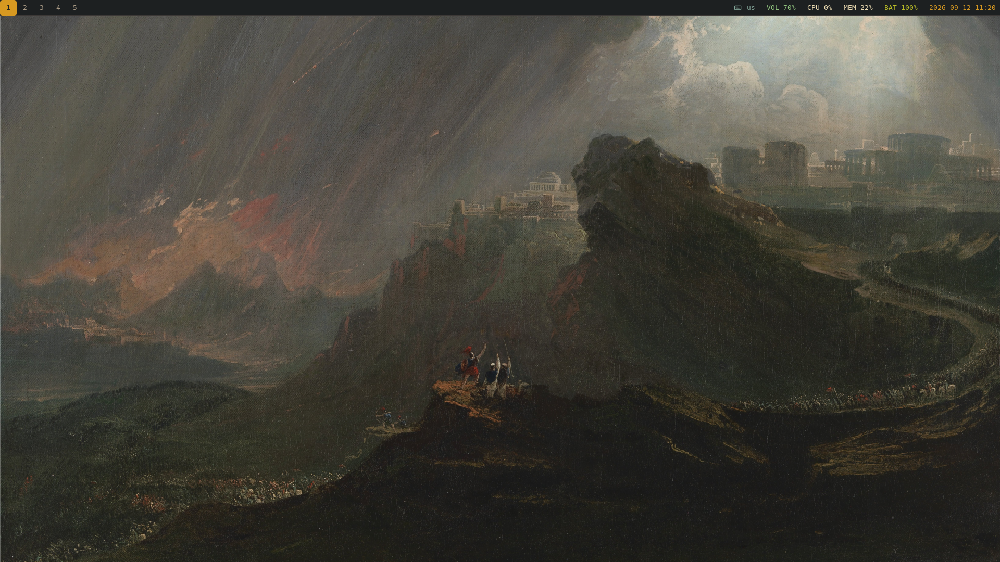
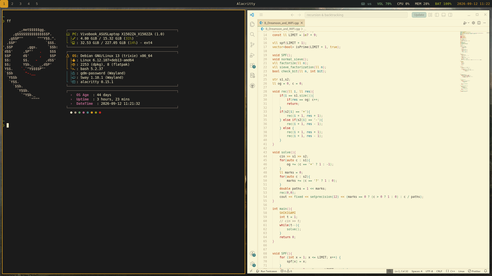

# dotfiles

A compact Debian + Sway desktop: Gruvbox Dark, keyboard-first tiling, and a small Wayland-native toolset. The configurations are arranged as stow-style packages, with each application’s files under its usual home-directory path.

> The Sway wallpaper path is `~/dotfiles/wallpapers/<file_name>.png`; keep the repository at `~/dotfiles` or update that line in `sway/.config/sway/config`.

## Preview





## Included

| Component | Purpose |
| --- | --- |
| [Sway](sway/.config/sway/config) | Wayland compositor, tiling, workspaces, input, and wallpaper |
| [Waybar](waybar/.config/waybar/config) | Top bar: workspaces, active window, layout, audio, CPU, memory, battery, and clock |
| [Wofi](wofi/.config/wofi/config) | Application launcher |
| [Alacritty](alacritty/.config/alacritty/alacritty.toml) | Terminal with Gruvbox colors |
| [Mako](mako/.config/mako/config) | Notification daemon |
| [swaylock](sway/.config/sway/lock.sh) | Gruvbox-themed screen lock |
| [Fastfetch](fastfetch/.config/fastfetch/config.jsonc) | Terminal system summary |
| [mpv](mpv/.config/mpv/mpv.conf) | GPU-accelerated video playback |

Supporting tools used by the Sway config are `blueman-applet`, `pamixer`, `grim`, `slurp`, `wl-clipboard` (`wl-copy`), Nautilus, Firefox, and VS Code.

## Install

Clone the repository at the expected path, then symlink the configuration directories you want to use:

```sh
git clone git@github.com:Maze-101/dotfiles.git ~/dotfiles
cd ~/dotfiles
stow alacritty fastfetch mako mpv sway waybar wofi
```

Install the packages listed above with your Debian package manager before starting Sway. Existing configuration files should be backed up first; `stow` will not overwrite them.

## Keybinds

`Super` is the Windows/Meta key.

| Keys | Action |
| --- | --- |
| `Super` + `Enter` | Open Alacritty |
| `Super` + `D` | Open Wofi application launcher |
| `Super` + `C` | Open VS Code |
| `Super` + `B` | Open Firefox |
| `Super` + `E` | Open Nautilus |
| `Super` + `X` | Close the focused window |
| `Super` + `Space` | Switch between US and Arabic keyboard layouts |
| `Super` + `Shift` + `R` | Reload Sway |
| `Super` + `Shift` + `E` | Exit Sway |
| `Print` | Select an area, save it to `~/Pictures/Screenshots`, and copy it to the clipboard |
| `Super` + `H` / `J` / `K` / `L` | Focus left / down / up / right |
| `Super` + `Shift` + `H` / `J` / `K` / `L` | Move the focused window left / down / up / right |
| `Super` + `1`–`5` | Switch to workspace 1–5 |
| `Super` + `Shift` + `1`–`5` | Move the focused window to workspace 1–5 |
| `Super` + `Escape` | Run the lock script |
| Media mute / volume keys | Toggle mute / lower volume 10% / raise volume 10% |
